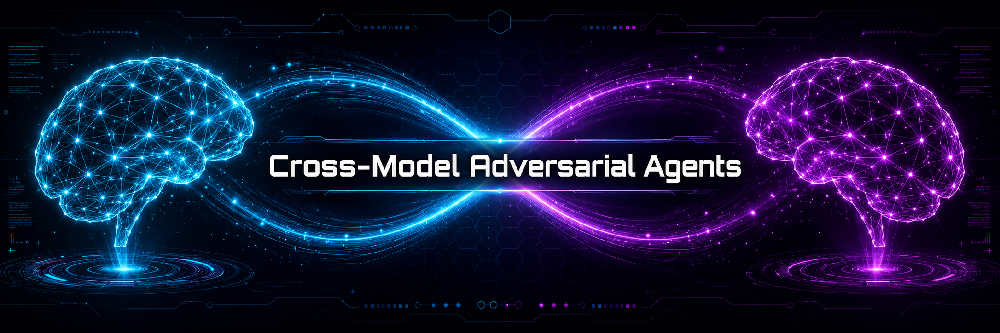

<p align="center">
  
</p>

<h1 align="center">Cross-Model Adversarial Agents</h1>

<p align="center">
  <b>Two frontier models. Each one reviews the other's work.</b><br>
  Bidirectional adversarial review between <b>Claude Code (Opus 4.7)</b> and <b>OpenAI Codex CLI (GPT-5.5)</b> — every plan, every diff, every commit goes through the other model's blind-spot filter before it ships.
</p>

<p align="center">
  <a href="LICENSE"></a>
  <a href="https://docs.claude.com/en/docs/claude-code"></a>
  <a href="https://github.com/openai/codex"></a>
  
  
  
  
</p>

<p align="center">
  <a href="#quickstart">Quickstart</a> ·
  <a href="#how-it-works">How it works</a> ·
  <a href="docs/USAGE.md">Usage guide</a> ·
  <a href="docs/PRD.md">Product spec</a> ·
  <a href="CHANGELOG.md">Changelog</a>
</p>

<p align="center"><sub>Maintained by <a href="mailto:vonzelle@vzttechconsulting.com">VZT Tech Consulting</a> · MIT licensed</sub></p>

---

## The problem

When one model plans, implements, and reviews its own work, it does not challenge its own assumptions. It has systematic blind spots baked into its training data. A second model — trained on different data, with different priors — catches what the first one misses.

```
                       single-model loop                              cross-model loop
                       ────────────────────                           ────────────────────────────────────
                       Plan  → Build  → Review                        Plan  →  Review (B)  →  Build
                       └──── same blind spots ────┘                          ↓
                                                                      Anti-slop (B scores A)
                                                                             ↓
                                                                      Devil's advocate (B)  →  Ship
```

This repo ships **31 agents, 4 skills, and a pipeline CLI** that wires that loop into Claude Code and Codex CLI. Gates block `git commit` until both models have signed off. Bypasses are logged with the developer's email and a reason.

---

## Quickstart

```bash
# 1. Install both CLIs
npm install -g @anthropic-ai/claude-code    # if you don't already have it
npm install -g @openai/codex
claude auth login
codex login

# 2. Clone and install the agents + skills + pipeline + git hook
git clone https://github.com/vonzelle-vzt/Cross-Model-Agents.git
cd Cross-Model-Agents
node scripts/install.js --yes

# 3. Verify everything wired up
node scripts/pipeline.js doctor
```

You should see:

```
ok  claude CLI available
ok  codex CLI available
ok  pre-commit hook installed
ok  config.json: providers configured
Doctor result: clean.
```

### First-five-minutes test drive

Open Claude Code in any project:

```
/codex-review          # have Codex adversarially review your current plan
/council Should we use SSR or CSR?   # parallel Claude vs Codex debate
Use the codex-reviewer agent to review my auth code.
```

Open Codex CLI in the same project:

```
@claude-reviewer Review my implementation.
@claude-devils-advocate Challenge my approach.
```

That's it. Cross-model review is now in your loop.

---

## How it works

### The pipeline

```
    Plan
     │
     ▼
  /codex-review (iterative — Codex challenges plan)  ──── BLOCKER
     │
     ▼
  Implement (you / Claude / Codex)
     │
     ▼
  Anti-Slop Gate (worker models, per-file fan-out)   ──── BLOCKER
     │     Score ≥ 7/10 to pass. Up to 2 fix rounds.
     ▼
  UI Validation Gate (if frontend files changed)     ──── BLOCKER
     │     Cross-model code review + agent-browser screenshots.
     ▼
  Devil's Advocate (frontier model challenges all assumptions)  ──── BLOCKER
     │
     ▼
  Gap Analysis (fallback model — spec vs build, 10 dimensions)  ──── BLOCKER
     │
     ▼
  git commit (blocked until all gates pass — or audited bypass)
     │
     ▼
  pipeline.js publish → GitHub commit statuses → PR → Greptile → Merge
```

### Architecture

```
                CLAUDE CODE                                CODEX CLI
                (Opus 4.7 / Sonnet 4.6 / Haiku 4.5)        (GPT-5.5 / GPT-5.4)

    Claude-side agents (delegate TO Codex)         Codex-side agents (delegate TO Claude)
    ───────────────────────────────────────        ──────────────────────────────────────
    codex-reviewer        ──review──→              claude-reviewer
    codex-devils-advocate ──challenge──→           claude-devils-advocate
    codex-architect       ──architecture──→        claude-architect
    codex-frontend        ──frontend──→            claude-frontend / claude-frontend-design
    codex-backend                                  claude-marketing  (Opus copy strength)
    codex-gap-analyst     ──gap analysis──→        claude-gap-analyst
    codex-qa              ──QA──→                  claude-qa
    codex-security        ──security audit──→      claude-security
    codex-anti-slop       ──slop scoring──→        anti-slop (Claude scores Codex)
    codex-ui-validator                             ui-validator

    Skills (slash commands)                        Orchestration agents
    ───────────────────────                        ──────────────────────
    /codex-review     iterative plan review        planner   (auto-sends to Claude)
    /council          multi-model debate           executor  (build + anti-slop)
    /delegate         coordinator mode             reviewer  (strict review)
    /pipeline-doctor  health-check + fix           council   (multi-model debate)
                                                   default / backend / frontend / explorer / tester
```

### Communication layer

Cross-model calls use **MCP (Model Context Protocol) servers** with CLI fallback:

| Direction | Primary (MCP) | Fallback (CLI) |
|---|---|---|
| Claude → Codex | `mcp__codex__codex(prompt, model, sandbox)` | `codex exec -m gpt-5.5 -s read-only ...` |
| Codex → Claude | `mcp claude_code` via claude-code-mcp | `env -u CLAUDECODE claude -p --model opus ...` |

MCP eliminates ~15s cold-start overhead, enables structured JSON responses, and removes the need for `--dangerously-skip-permissions`.

### Enforcement layer

Three mechanisms prevent ungated code from reaching `main`:

| Mechanism | Type | What it does |
|---|---|---|
| **Post-edit reminder** | Claude Code `PostToolUse` hook | Nags after every file edit |
| **Commit gate** | Claude `PreToolUse` hook + git `pre-commit` hook | **Blocks `git commit`** |
| **Session check** | Claude Code `Stop` hook | Warns if you end the session with gates incomplete |

State lives in `.pipeline/state-<branch>.json` (project root, gitignored). Atomic writes + file locking prevent races. GitHub commit statuses are published from the same state via `pipeline.js publish`.

---

## Who is this for

- **Solo developers** using AI coding assistants who want a structurally different second opinion.
- **Teams** enforcing cross-model quality gates in AI-assisted workflows.
- **Security-sensitive shops** that need an independent reviewer with different training data.

---

## What's new in v3.0.0 (May 2026)

- **Model lineup refreshed** — Opus 4.7, GPT-5.5, Haiku 4.5 worker tier, Sonnet 4.6 fallback.
- **Per-gate model tiering** — anti-slop and UI gates fan out across cheap worker models; devil's advocate stays on frontier. Configured in `config.json` under `routing.gates`.
- **`pipeline.js doctor`** — single-command environment health check.
- **`pipeline.js bypass --reason "<text>"`** — every commit-gate override is now logged, with a 12-char minimum reason.
- **Cross-platform pre-commit hook** — installer sets `git core.hooksPath`. The hook actually fires out of the box on macOS, Linux, and Windows.
- **Atomic state writes + file locking** — no more lost gate results when multiple agents write in parallel.
- **`status --json`** — machine-readable state for CI / IDE plugins.
- **`gate --violations file.json`** — gates push full structured-JSON violation detail into pipeline state.
- **Legacy bash scripts removed** — they read state from a different path and were silently disabling gates.

Full details in [CHANGELOG.md](CHANGELOG.md). Day-to-day usage in [docs/USAGE.md](docs/USAGE.md).

---

## Give this to your agent

Copy-paste this block into Claude Code, Codex, Cursor, Windsurf, or any AI coding agent — it sets up the entire system:

> **Clone and install the cross-model adversarial review system. This gives me bidirectional code review between Claude (Opus 4.7) and Codex (GPT-5.5) — each model acts as the other's devil's advocate.**
>
> ```bash
> git clone https://github.com/vonzelle-vzt/Cross-Model-Agents.git
> cd Cross-Model-Agents
> node scripts/install.js --yes
> ```
>
> **Then verify with:**
> ```bash
> node scripts/pipeline.js doctor
> ```
>
> **What I get:** 10 Claude Code agents, 21 Codex agents, 4 slash-command skills, pipeline enforcement (commit gates, post-edit reminders, session checks), anti-slop scoring, UI validation, multi-model council debates, observability dashboard. All cross-model calls use MCP servers with CLI fallback.

---

## Model Lineup (May 2026)

The config is provider-agnostic. Add a new model in one entry in `config.json`.

### Anthropic side

| Model | Role | Context | Use |
|---|---|---|---|
| **claude-opus-4-7** | Frontier | 1M / 128k out | Devil's advocate, architect, planner, frontend design |
| **claude-sonnet-4-6** | Fallback | 1M | Gap analysis, general review |
| **claude-haiku-4-5** | Worker | 200K | Per-file anti-slop scoring (fan-out) |

Opus 4.7 (2026-04-16) introduced task budgets, a new tokenizer (~1.35× tokens), and the `xhigh` reasoning tier. Haiku 4.5 is purpose-built for the "Sonnet/Opus plans, Haiku executes" multi-agent pattern.

### OpenAI side

| Model | Role | Context | Use |
|---|---|---|---|
| **gpt-5.5** | Frontier | 400K | Devil's advocate, security audit, cross-model review |
| **gpt-5.4** | Fallback | 400K | Cheaper general-purpose review |
| **gpt-5.4-mini** | Worker | 400K | Per-file scoring fan-out |

GPT-5.5 (2026-04-23) is materially better at mid-loop error recovery — `max_rounds` dropped 3 → 2 in v3.0.0 as a result.

### Optional: OpenAI's codex-plugin-cc

OpenAI shipped an official `codex-plugin-cc` for Claude Code in 2026. It exposes `/codex:review` and `/codex:adversarial-review`. We bundle it as an **opt-in alternative backend** under `providers.codex_plugin_cc` in `config.json` — set `enabled: true` to route through it.

---

## Pipeline CLI

```bash
node pipeline.js init                                Initialize checkpoint
node pipeline.js gate <name> <status> [score] [round] [--violations file.json]
node pipeline.js check                               Verify all gates passed
node pipeline.js reset [--all]                       Clear pipeline state
node pipeline.js track <file>                        Track a changed file
node pipeline.js report [--json]                     Show gate status
node pipeline.js status [--json]                     Alias of report
node pipeline.js log [--last N] [--gate X] [--event Y]
node pipeline.js publish                             Post results as GitHub commit statuses
node pipeline.js fetch                               Pull GitHub statuses into local state
node pipeline.js bypass --reason "<text>"            Audited 30-minute commit-gate override
node pipeline.js doctor                              Health check (node, git, hooks, gh, config)
node pipeline.js help [cmd]                          Per-subcommand help
node pipeline.js --version                           Print version
```

### Doctor output (example)

```
$ node pipeline.js doctor
Pipeline Doctor — checking environment...

  ok  Node.js 20.19.6
  ok  Git: git version 2.53.0
  ok  Inside git repo: /path/to/your/repo
  ok  git core.hooksPath = /home/you/.githooks
  ok  pre-commit hook installed at /home/you/.githooks/pre-commit
  ok  gh CLI available
  ok  claude CLI available
  ok  codex CLI available
  ok  config.json: providers configured (codex, claude, codex_plugin_cc)
  ok  config.json: pass_threshold=7, max_rounds=2
  ok  .pipeline/ directory present
  ok  .gitignore excludes .pipeline/

Doctor result: clean.
```

### Status JSON shape

```bash
$ node pipeline.js status --json
{
  "session_id": "a1b2c3d4e5f6",
  "repo": "my-app",
  "branch": "feature/auth",
  "changed_files": ["src/auth.ts", "src/api/login.ts"],
  "has_frontend_changes": false,
  "gates": {
    "anti_slop": { "status": "passed", "score": 8.5, "round": 1, "updated_at": "..." },
    "devils_advocate": { "status": "completed", "score": null, "round": null, "updated_at": "..." }
  },
  "commit_allowed": false,
  "missing": [
    "BLOCKED: gap_analysis gate NOT RUN. Run the codex-gap-analyst agent."
  ],
  "active_bypass": null
}
```

---

## Anti-Slop Scoring

The anti-slop gate hunts for 10 specific patterns of AI-generated code bloat. Each file is scored independently.

### Formula

```
SCORE = 10 − (critical × 3) − (moderate × 1) − (minor × 0.5)

PASS = score ≥ 7
FAIL = score < 7 → fix + rescore (max 2 rounds in v3.0.0)
```

### The 10 Patterns

| # | Pattern | Severity | Catches |
|---|---|---|---|
| 1 | Over-Engineered Abstractions | Critical (−3) | Factory/Builder/Strategy used once; interfaces with one implementation |
| 2 | Premature Helpers | Critical (−3) | Utility longer than the code it replaces |
| 3 | Comment-Restates-Code | Minor (−0.5) | `// increment counter` above `counter++` |
| 4 | Wrapper-for-Wrapper | Critical (−3) | `fetchData()` → `getData()` → `api.get()` three layers deep |
| 5 | Kitchen-Sink Error Handling | Moderate (−1) | try/catch around non-throwing code |
| 6 | Template Paste | Critical (−3) | Tutorial code pasted without adaptation |
| 7 | Type Gymnastics | Moderate (−1) | `Omit<Pick<Partial<T>,K>,E>` where `{ name: string }` works |
| 8 | Unnecessary State | Moderate (−1) | useState for derived values; Redux for a boolean |
| 9 | Dead Weight | Minor (−0.5) | Unused imports, always-true conditions, commented-out code |
| 10 | Verbose > Clear | Minor (−0.5) | 20 lines where 5 is shorter AND clearer |

---

## UI Validation Gate

Auto-triggers when frontend files change (`.tsx`, `.jsx`, `.css`, `.vue`, `.svelte`). Cross-model, same scoring formula.

### Two-Phase Validation

```
Phase 1: Cross-Model Code Review (via MCP)
   Claude code → Codex scores UI quality
   Codex code → Claude scores UI quality

Phase 2: Browser Validation (agent-browser CLI)
   Desktop viewport (1920×1080) — screenshot + console
   Mobile viewport  (390×844)   — screenshot + console
```

### The 10 UI Patterns

| # | Pattern | Severity | Catches |
|---|---|---|---|
| 1 | Missing UI States | Critical (−3) | No loading, error, empty, or skeleton states |
| 2 | No Accessibility | Critical (−3) | Missing ARIA, no keyboard nav, bad contrast |
| 3 | Not Responsive | Critical (−3) | Hardcoded widths, no breakpoints, small touch targets |
| 4 | Generic AI Aesthetics | Critical (−3) | Inter/Roboto, default blue (#3B82F6), purple gradients |
| 5 | Design System Bypass | Moderate (−1) | Inline styles, wrong spacing scale |
| 6 | God Components | Moderate (−1) | 300+ line components mixing data + logic + presentation |
| 7 | No User Feedback | Moderate (−1) | Async action with no visual feedback |
| 8 | No Reduced-Motion | Minor (−0.5) | Missing `prefers-reduced-motion` |
| 9 | Inconsistent Spacing | Minor (−0.5) | Mix of arbitrary px and design tokens |
| 10 | No Error Boundaries | Minor (−0.5) | Async UI section without error boundary |

---

## Skills (Claude Code)

### `/codex-review` — Adversarial Plan Review

Send the current plan to Codex for adversarial review. Iterative loop (max 5 rounds) until APPROVED.

### `/council` — Multi-Model Deliberation (Agent Teams)

Parallel debate between Claude and Codex. Each model formulates a position, rebuts the other up to 3 rounds, and synthesizes a decision: FULL CONSENSUS / PARTIAL CONSENSUS / DEADLOCK.

```
/council Should we use microservices or a monolith?
/council Should we use SSR or CSR for this app?
```

### `/delegate` — Coordinator Mode

Scan agent/skill inventory, create a team via `TeamCreate`, spawn agents in worktree-isolated parallel runs. You stay coordinator.

### `/pipeline-doctor` — Pipeline Health Check (new in v3.0.0)

Runs `pipeline.js doctor`, parses output, and walks you through fixing each problem. Use `/pipeline-doctor --fix` to apply remediations after confirmation.

---

## Configuration

Central config: `config.json` (project root). The system is **provider-agnostic** — adding a new model is one entry.

```json
{
  "version": "3.0.0",
  "maintainer": {
    "name": "VZT Tech Consulting",
    "contact": "vonzelle@vzttechconsulting.com"
  },
  "providers": {
    "codex": {
      "model": "gpt-5.5",
      "fallback_model": "gpt-5.4",
      "worker_model": "gpt-5.4-mini",
      "reasoning_effort": "xhigh",
      "mcp_tool": "mcp__codex__codex"
    },
    "claude": {
      "model": "claude-opus-4-7",
      "fallback_model": "claude-sonnet-4-6",
      "worker_model": "claude-haiku-4-5",
      "supports_task_budgets": true
    }
  },
  "routing": {
    "gates": {
      "anti_slop":      { "scorer": "codex", "tier": "worker",   "fanout": true,  "task_budget": 4000  },
      "ui_validation":  { "scorer": "codex", "tier": "worker",   "fanout": true,  "task_budget": 5000  },
      "devils_advocate":{ "scorer": "codex", "tier": "frontier", "fanout": false, "task_budget": 12000 },
      "gap_analysis":   { "scorer": "codex", "tier": "fallback", "fanout": false, "task_budget": 8000  }
    }
  },
  "scoring":     { "pass_threshold": 7, "max_rounds": 2, "score_min": 0, "score_max": 10 },
  "concurrency": { "max_parallel_claude": 3, "max_parallel_codex": 4, "max_fanout_workers": 8 },
  "bypass":      { "require_reason": true, "min_reason_length": 12, "log_all_bypasses": true }
}
```

### Adding a new provider (e.g. Gemini)

1. Add an entry to `providers.gemini` with `model`, `mcp_server`, `mcp_tool`, `role`.
2. Add the MCP server definition to `mcp_servers.gemini`.
3. Reference it in `routing.gates.<gate>.scorer` to route work to it.

That's it. Agents that consume the config will pick it up automatically.

---

## Installation

### Prerequisites

| Tool | Subscription | Auth |
|---|---|---|
| [Claude Code](https://docs.claude.com/en/docs/claude-code) | Claude MAX or Anthropic API key | `claude auth login` |
| [Codex CLI](https://github.com/openai/codex) | Codex Pro or OpenAI API key | `codex login` |
| Node.js 18+ | — | — |
| Git 2.x | — | — |
| `gh` CLI (optional) | — | for `publish` / `fetch` |

### Cross-Platform Install (recommended)

```bash
git clone https://github.com/Dallionking/cross-model-agents.git
cd cross-model-agents
node scripts/install.js
```

Five phases: prereqs → core install (agents/skills/pipeline/hook) → optional CLI tools → optional MCP servers → summary.

The installer also runs `git config --global core.hooksPath ~/.githooks` so the pre-commit hook actually fires. Without this, the previous releases were enforcement-in-name-only.

### Unattended / CI install

```bash
# Accept all defaults, no prompts
node scripts/install.js --yes

# Agents + hook only, skip every MCP
node scripts/install.js --minimal

# Pre-approve specific MCPs
node scripts/install.js --yes --with codex,claude-code-mcp,context7

# CI without the global hook
node scripts/install.js --yes --skip-hook
```

API keys can be supplied via environment variables: `EXA_API_KEY`, `FIRECRAWL_API_KEY`, `GREPTILE_API_KEY`.

### macOS/Linux (legacy bash)

```bash
./scripts/install.sh
```

Functionally equivalent to `install.js` but lacks the new flags. Recommended only when Node is unavailable.

### Uninstall

```bash
node scripts/uninstall.js          # interactive
node scripts/uninstall.js --yes    # unattended
node scripts/uninstall.js --purge  # also remove pre-commit hook + clear core.hooksPath
```

### What Gets Installed

| Component | Count | Location |
|---|---|---|
| Claude Code agents | 10 | `~/.claude/agents/` (symlinked / copied) |
| Claude Code skills | 4 | `~/.claude/skills/` |
| Codex agents | 21 | `~/.codex/agents/` |
| Pipeline CLI | 1 | `~/.local/bin/pipeline.js` |
| Pre-commit hook | 1 | `~/.githooks/pre-commit` (sh shim) |
| Pre-commit Node helper | 1 | `~/.githooks/pipeline-precommit.js` |

---

## MCP Requirements

### Required (for cross-model calls)

| MCP | Purpose |
|---|---|
| `codex-mcp-server` | Claude → Codex |
| `claude-code-mcp` | Codex → Claude |

### Optional

| MCP | API Key? | Used by |
|---|---|---|
| Auggie (codebase-retrieval) | No | planner, reviewer, council, gap-analyst |
| GitNexus | No | architect, planner, gap-analyst |
| EXA | Yes | devils-advocate, architect, security |
| shadcn/ui | No | frontend agents |
| Greptile | Yes | post-commit PR review |
| Ref | No | docs lookup |
| Context7 | No | library docs |
| Firecrawl | Yes | web scraping |
| Sequential Thinking | No | structured multi-step reasoning |

Agents gracefully skip unavailable MCPs.

---

## Usage

> **For the full day-to-day guide — what each gate does, when to invoke it, troubleshooting, cheatsheets — see [docs/USAGE.md](docs/USAGE.md).**

### Slash commands (Claude Code)

```
/codex-review           Adversarial review of the current plan (max 5 rounds)
/council <question>     Parallel Claude/Codex debate (max 3 rounds)
/delegate               Coordinator mode — spawn worktree-isolated agents
/pipeline-doctor        Run health check and walk through fixes
/pipeline-doctor --fix  Same, but apply remediations after confirmation
```

### Codex agents you can summon from Claude Code

```
Use the codex-reviewer agent to review my code.
Use the codex-devils-advocate agent to challenge my approach.
Use the codex-anti-slop agent to score this file.
Use the codex-ui-validator agent to score this component.
Use the codex-security agent to audit this auth flow.
Use the codex-gap-analyst agent to compare spec vs implementation.
Use the codex-architect agent for system design review.
```

### Claude agents you can summon from Codex CLI

```
@claude-reviewer Review my implementation.
@claude-devils-advocate Challenge this approach.
@claude-frontend-design Build this layout.       # Opus design strength
@claude-marketing Write this launch copy.        # Opus copy strength
@claude-gap-analyst Compare spec vs implementation.
@claude-security Audit this auth flow.
```

### Daily pipeline commands

```bash
node pipeline.js doctor                # Health check the install
node pipeline.js status                # See what gates still need to run
node pipeline.js status --json         # Machine-readable
node pipeline.js track src/auth.ts     # Track a changed file
node pipeline.js log --last 20         # Structured event log
node pipeline.js reset                 # Clear current-branch state
node pipeline.js publish               # Post results as GitHub commit statuses
node pipeline.js fetch                 # Pull GitHub statuses into local state
node pipeline.js bypass --reason "<≥12 chars>"   # Audited commit-gate override
```

### A full session in practice

```
1. git checkout -b feature/auth
2. Draft a plan in chat.
3. /codex-review                              → APPROVED after 2 rounds
4. Implement (Claude does the edits).
5. Use the codex-anti-slop agent.             → 6/10 fail on auth.ts (wrapper-for-wrapper)
6. Fix it. Rescore.                           → 8/10 pass
7. Use the codex-devils-advocate agent.       → completed, no blockers
8. Use the codex-gap-analyst agent.           → completed, no blockers
9. node pipeline.js check                     → exit 0
10. git commit                                → unblocked
11. node pipeline.js publish                  → statuses appear on PR
12. Greptile reviews                          → green
13. Merge.
```

See [docs/USAGE.md](docs/USAGE.md) for the full mental model, per-gate details, scoring formulas, the 20 anti-slop + UI patterns, model routing, bypass policy, and a troubleshooting table.

---

## Observability Dashboard

Open `scripts/dashboard.html` directly in a browser (zero dependencies, dark theme). Drop in `.pipeline/logs/*.jsonl` files via drag-and-drop. Shows pass/fail rates per gate, score trend charts, event timeline, and common failure patterns.

---

## Testing

### Test Suite

| Tier | Tests | API key? |
|---|---|---|
| Static validation | 191 checks | No |
| Pipeline unit tests | **43 tests** (v3.0.0 added 14) | No |
| Integration smoke tests | 5 checks (dry-run) | Optional |

```bash
# Run all tests
node tests/static/validate-agents.js \
  && node tests/pipeline/test-pipeline.js \
  && node tests/integration/smoke-test.js

# Live integration mode (requires API key)
ANTHROPIC_API_KEY=sk-... node tests/integration/smoke-test.js --live
```

### CI

GitHub Actions runs static + pipeline tests on every push and PR.

---

## Bypass Policy (v3.0.0 audit-logged)

Two bypass paths, both logged:

```bash
# Path 1: explicit subcommand (recommended)
pipeline.js bypass --reason "hotfix for prod outage at 02:14 PT — rolling forward"
git commit -m "..."

# Path 2: environment variable on the commit
SKIP_PIPELINE_CHECK=1 PIPELINE_BYPASS_REASON="ci: shadow run, gates not applicable" \
  git commit -m "..."
```

Every bypass is logged to `.pipeline/logs/<date>.jsonl` with:
- `author` (from `git config user.email`)
- `reason`
- `branch`
- `timestamp`

Query with `pipeline.js log --event commit_bypassed`.

---

## Project Structure

```
cross-model-agents/
├─ assets/
│  └─ banner.png
├─ claude-code/
│  ├─ agents/                   # 10 Claude Code agents (.md, v2.0.0+)
│  └─ skills/
│     ├─ codex-review/
│     ├─ council/
│     ├─ delegate/
│     └─ pipeline-doctor/      # NEW v3.0.0
├─ codex/
│  └─ agents/                   # 21 Codex agents (.toml)
├─ config.json                  # Providers, routing, scoring, concurrency, bypass
├─ docs/
│  ├─ PRD.md                    # NEW v3.0.0
│  └─ auto-routing.md
├─ scripts/
│  ├─ install.js                # Cross-platform installer (--yes / --minimal / --with)
│  ├─ install.sh                # Legacy bash installer
│  ├─ uninstall.js              # NEW v3.0.0
│  ├─ uninstall.sh              # Legacy bash uninstaller
│  ├─ verify-install.sh
│  ├─ pipeline.js               # v3.0.0 — doctor, bypass, status --json, gate --violations
│  └─ dashboard.html
├─ tests/
│  ├─ static/validate-agents.js     # 191 checks
│  ├─ pipeline/test-pipeline.js     # 43 tests
│  └─ integration/smoke-test.js     # 5 dry-run + N live
├─ CHANGELOG.md                 # NEW v3.0.0
├─ CODE_OF_CONDUCT.md           # Updated v3.0.0 — VZT Tech Consulting maintainer
├─ CONTRIBUTING.md
├─ LICENSE                      # MIT
└─ README.md
```

---

## Contributing

See [CONTRIBUTING.md](CONTRIBUTING.md).

Key things to know:
- Agents are plain text (Markdown for Claude, TOML for Codex) — no build step.
- Agents are **symlinked** by default — changes to source files are reflected immediately.
- All agents include version numbers (YAML frontmatter for `.md`, `version` field for `.toml`).
- Cross-model calls use MCP servers as the primary channel, with CLI fallback.
- Model config is centralized in `config.json` — no hardcoded model IDs in agents.
- The anti-slop scoring formula is non-negotiable.
- The pipeline enforcement scripts gate commits — do not weaken their checks.
- Gate agents must output structured JSON for pipeline integration.

---

## License

[MIT](LICENSE) — see file for full text.

---

## Maintainer

**VZT Tech Consulting**
Contact: [vonzelle@vzttechconsulting.com](mailto:vonzelle@vzttechconsulting.com)
Issues: <https://github.com/Dallionking/cross-model-agents/issues>
